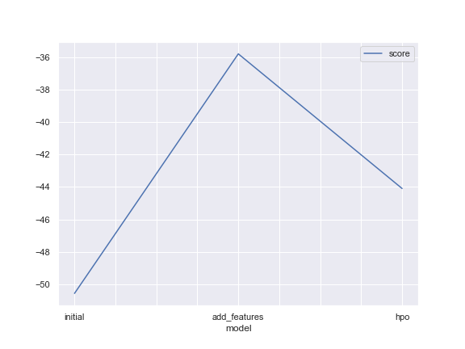
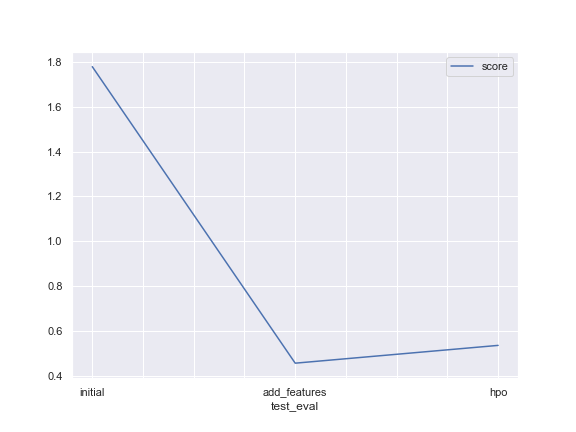

# Report: Predict Bike Sharing Demand with AutoGluon Solution
#### Nader Salama

## Initial Training
### What did you realize when you tried to submit your predictions? What changes were needed to the output of the predictor to submit your results?
I had some problems starting the Autogluon on my local machine. but I managed to get it to work by reading more into the official documents in auto.gluon.ai. I also did everything in the SageMaker studio and was able to compare scores and performance between both. 

### What was the top ranked model that performed?
Top score was achieved in the second phase of adding new features to the train & test sets. with a __score of 0.45618 using WeightedEnsemble_L3 model.__

## Exploratory data analysis and feature creation
### What did the exploratory analysis find and how did you add additional features?
During the EDA process I managed to first get an overview of the main characteristics of the Train set. I got the different distribution of the different features. The Temp features were normally distributed. The Humidity and Windspeed features are right and left skewed respectively.
Season,	Holiday, Workingday, Weather are categorical features.
Datetime feature needed more investigation to subsetting into smaller timeframes to measure the effect of each sub timeframe.
Finally from plotting the timeseries of the count vs the different times out in the years. I found out __demand peaks happens during summer time from Aug to Oct.__

### How much better did your model preform after adding additional features and why do you think that is?
THe model imporved by __74.36%__ after perfoming feature engineering process and adding different features that affected our model accuracy. __Hours , Days , Months and Years__ were the features added. That happend due to a __strong correlation__ betwen a hidden feature such as Hours which was inside the Datetime feature.

## Hyper parameter tuning
### How much better did your model preform after trying different hyper parameters?
Actually the model accuracy didn't get better than the previous added new feature model. that happend due to not fully tuning the appropriate paramter that could mainly affect the overall perfomance of the model. More tuning and training time is needed.
__Model decreased by -17.40%.__

### If you were given more time with this dataset, where do you think you would spend more time?
Get into a more in-depth of the different features that could have a indirect effect on the model performance. Such as implementing a one hot encoder on the categorical features. Training time also would be needed to have a noticable impact on the test results.

### Create a table with the models you ran, the hyperparameters modified, and the kaggle score.
|Model|Timelimit|Presets|HyperParameters|Score|
|--|--|--|--|--|
|initial|time_limit = 600|presets='best_quality'|None|1.77919|
|add_features|time_limit = 600|presets='best_quality'|Feature Manipulation|0.45618|
|hpo|time_limit = 600|presets='best_quality'|NN and LightGBM|0.53554|

### Create a line plot showing the top model score for the three (or more) training runs during the project.

### Create a line plot showing the top kaggle score for the three (or more) prediction submissions during the project.

## Summary
In this project I was able to apply all the concepts that were covered in Introduction to Machine Learning course, by using different skills I was able to develop a machine learning regression model by using the autogluon framework, and participate in a kaggle competition and have a decent model score.